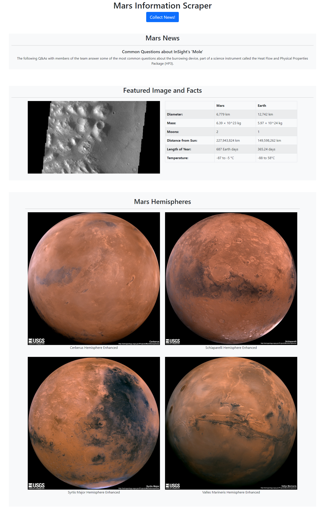

# web-scraping-challenge
This assignment consisted of using python and html to build a web application.

# What the code does (in general terms)
The code scrapes four (4) websites for information related to Mars and creates a webpage to display the information.

# What the code collects

The **mission_to_mars.ipynb** code uses Splinter, BeautifulSoup, and Pandas to collect the following:
    
    1. The title and teaser text of the latest news from [here](https://redplanetscience.com/).

    2. The featured image from [here](https://spaceimages-mars.com).

    3. A table containing Mars facts from [here](https://galaxyfacts-mars.com).

    4. The images and titles of the four (4) mars hemispheres from [here](https://marshemispheres.com/).

The **app.py** and **scrape_mars.py** code uses MongoDB with Flask templating to collect the same information as above, and uses **index.html**, **style.css**, and Bootstrap 5 to create a webpage displaying the information.

A screenshot of the webpage can be seen below:
